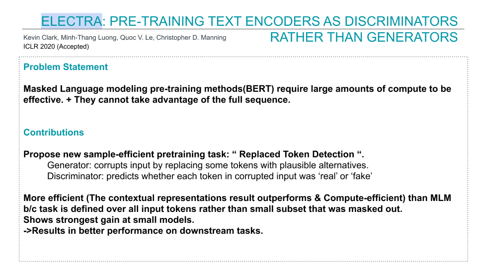
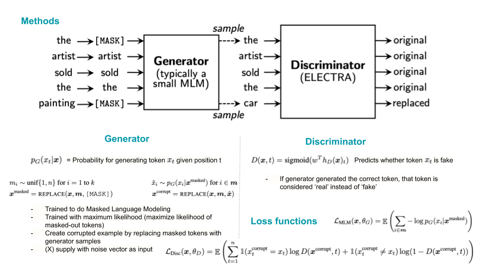
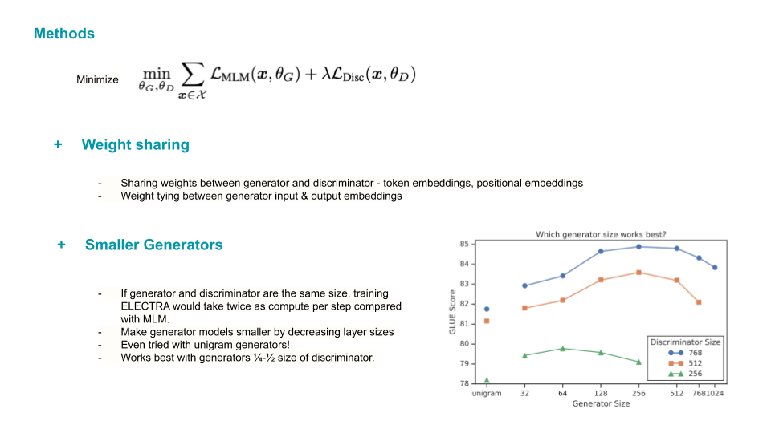
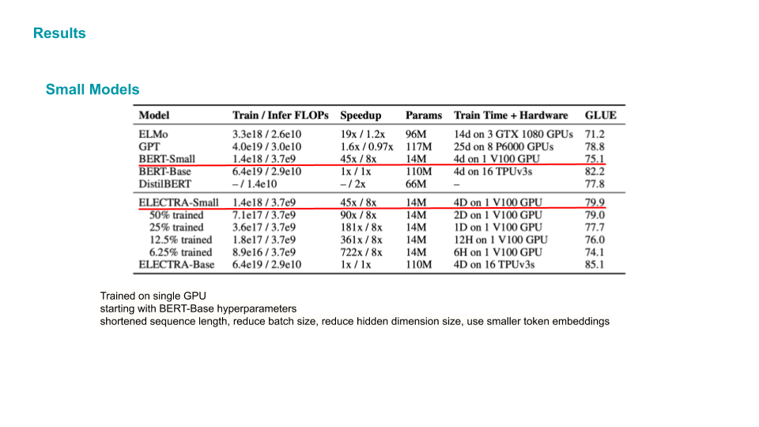
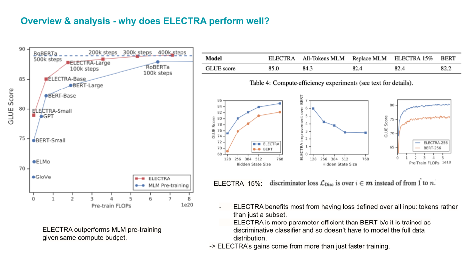
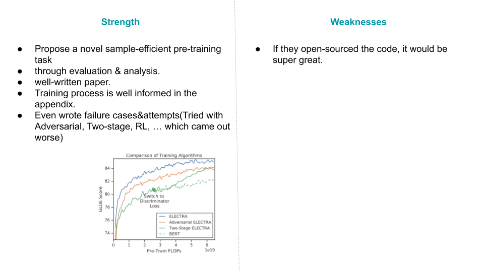

# ELECTRA: Pre-training Text Encoders as Discriminators Rather Than Generators
##### [(openreview link)](https://openreview.net/forum?id=r1xMH1BtvB)

첫 글은 연구실 논문리딩그룹에서 내가 발표했던 슬라이드를 활용하기로 하였다. 시간이 있을 때 설명을 더 추가할 예정!

