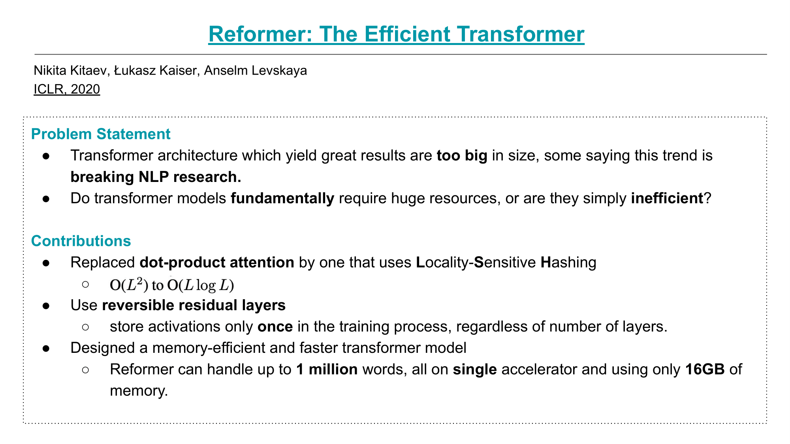
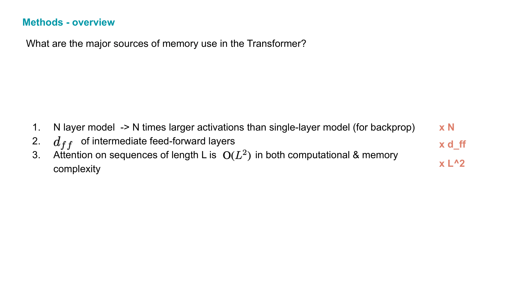
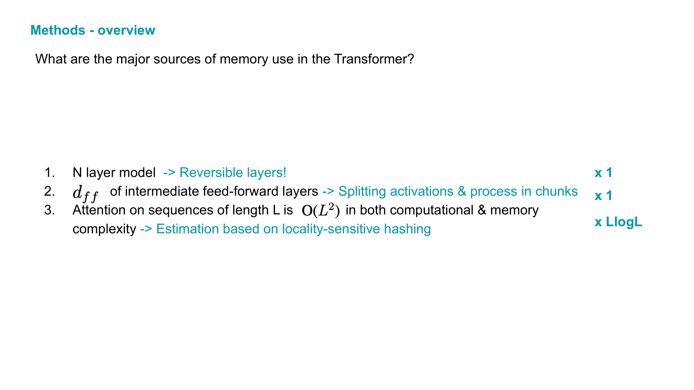
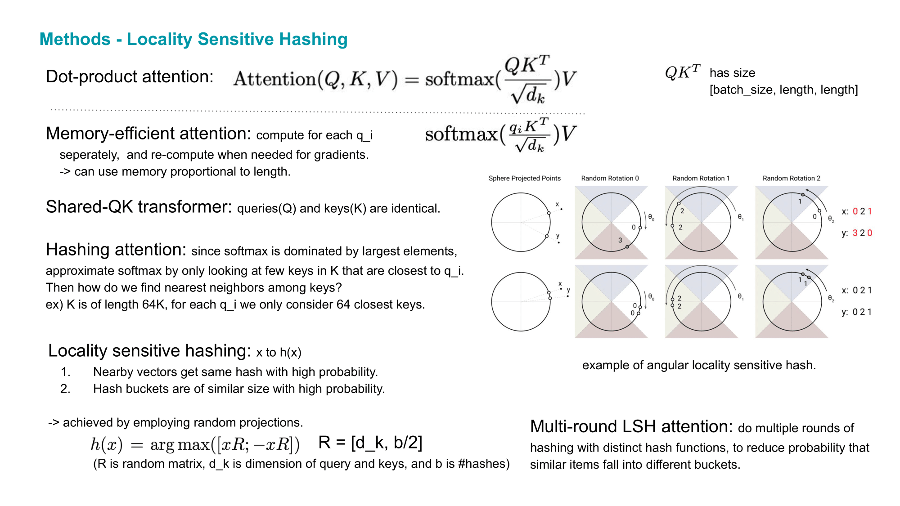
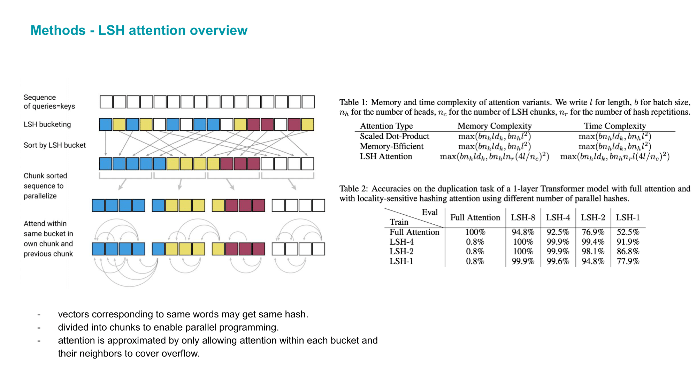
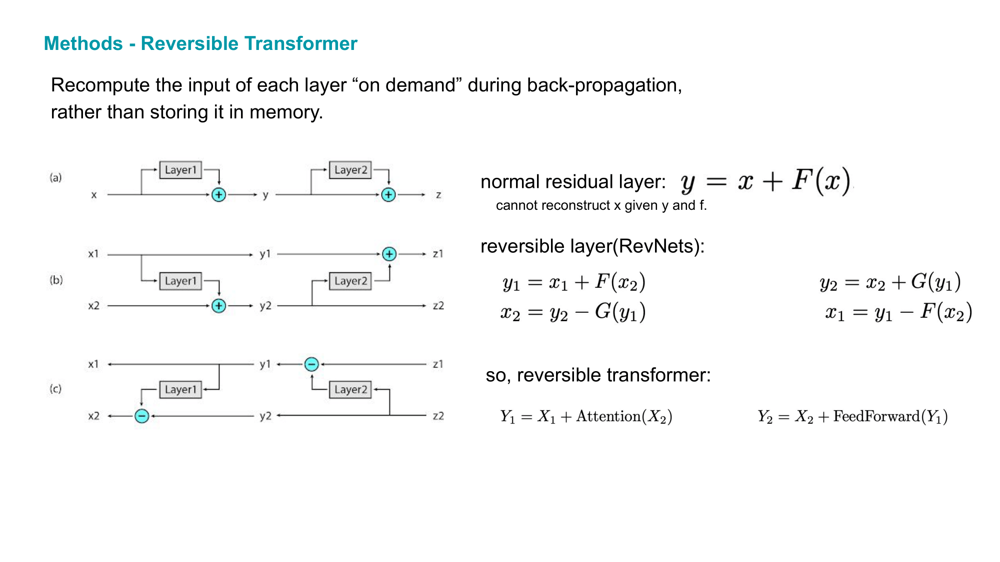
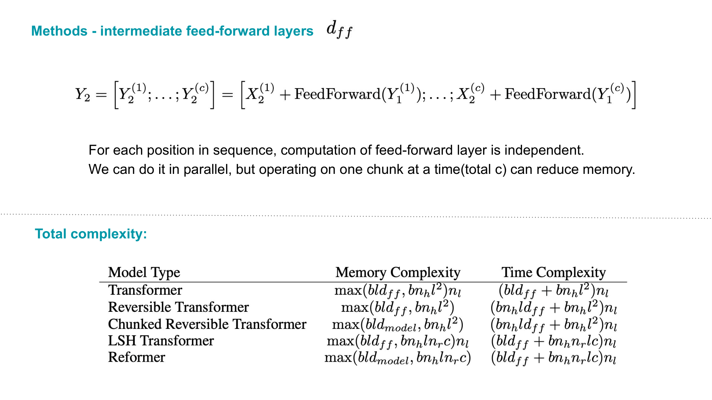
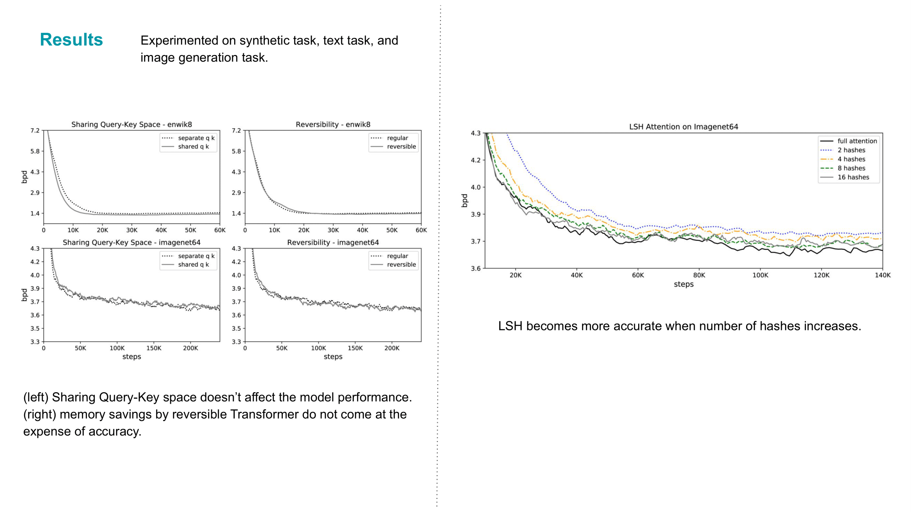
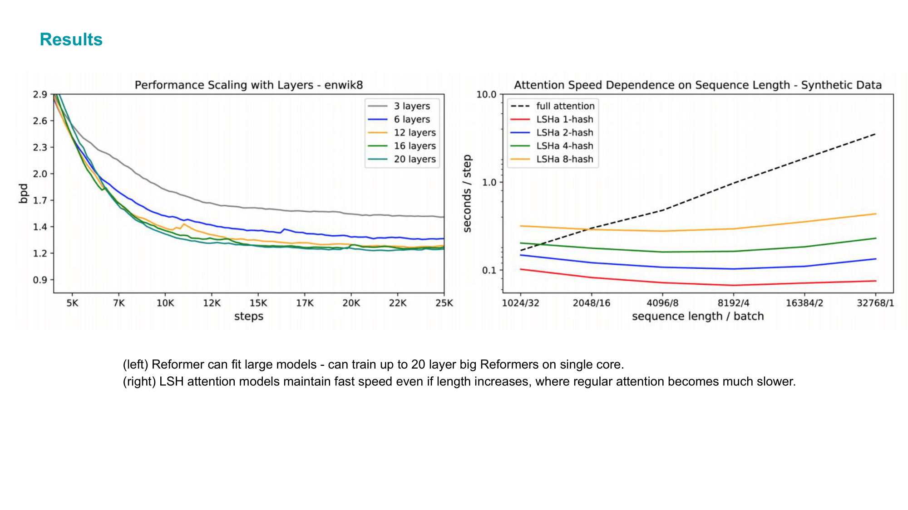
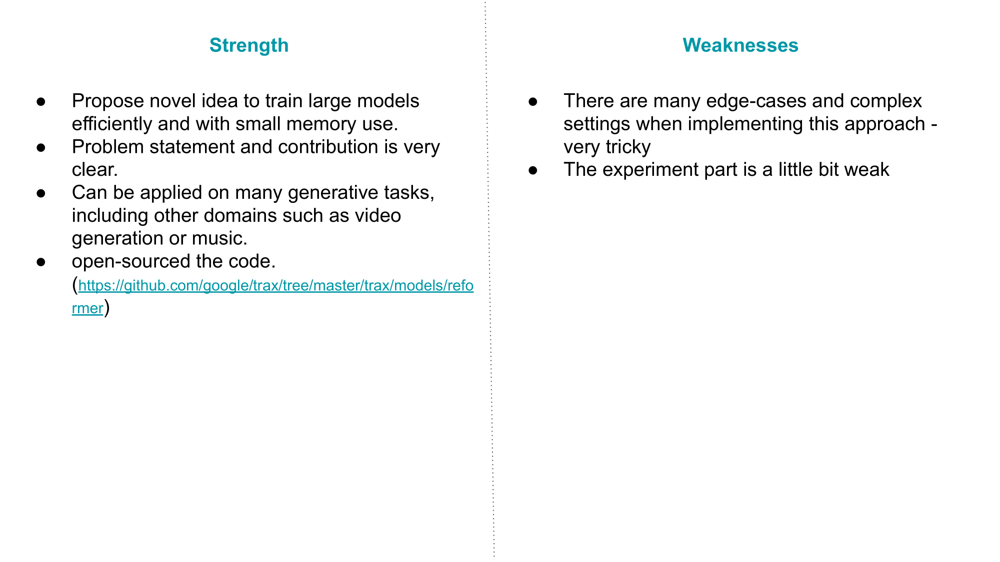

# Reformer: the efficient Transformer
[pdf](https://arxiv.org/pdf/2001.04451.pdf)

처음에 이 논문이 나왔을떄는 정말 놀랐다. locality-sensitive hashing을 이용해서
원래 sequence length의 제곱에 비례하는 attention 과정의 time complexity를
linear하게 단축시킬 수 있다니! 후속 연구가 활발히 이루어져서 더 발전되었으면 좋겠다.

