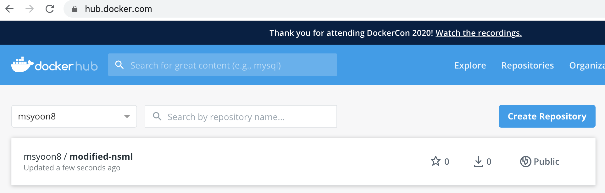

[NSML](https://ai.nsml.navercorp.com/intro) 을 인턴 기간 중 사용하게 되면서 docker image를 띄우고, 컨테이너에 넣어서 수정하고, 다시 push해야하는 일이 생겼다.
나중에 까먹지 않도록, 각자 과정에 대해서 간단하게 기록해보려고 한다.

기본적으로 docker run을 하게 되면 해당 container안에 있는 process가 다 돌아가게 되면 container는 exit하게 되고, 그 후에 다시 그 container를 run시킨다면 그 전에 작업했던 결과물들이 다 날라가게 된다(초기의 값으로 돌아가게 된다 TT)

따라서 나는 `docker run -it [CONTAINER_NAME] [COMMAND(보통 /bin/bash)] ` 로 처음에 실행해놓은 docker를 `exit` 시키지 않고 그 쉘은 작업이 끝날때까지 놔둔다...ㅎㅎ


- 현재 돌고 있는 Container 확인: `docker ps -al`

```
user@AL01333530 ~ % docker ps -al
CONTAINER ID        IMAGE                  COMMAND             CREATED             STATUS              PORTS               NAMES
6eb43f8766c0        msyoon8/fairseq-nsml   "/bin/bash"         8 hours ago         Up 8 hours                              sad_buck
```


- 해당 container "commit" 하기: `docker commit [CONTAINER_NAME] [NEW_IMAGE_NAME]`

```
user@AL01333530 ~ % docker commit sad_buck modified-nsml
sha256:59e86dfa8921492b020d0d258d05c47f0049e35141c291fe6e38cde645ee0fed
```


- 만들어진 docker image 확인: `docker images`를 하면 된다.

```
user@AL01333530 ~ % docker images
REPOSITORY             TAG                                      IMAGE ID            CREATED              SIZE
modified-nsml          latest                                   59e86dfa8921        About a minute ago   11GB
msyoon8/new-nsml       latest                                   106f53376a55        8 hours ago          11GB
start                  latest                                   7789300f795a        8 hours ago          10.9GB
msyoon8/fairseq-nsml   latest                                   7789300f795a        8 hours ago          10.9GB
<none>                 <none>                                   34ad76557739        9 hours ago          110MB
python                 alpine                                   bcf3965d8456        4 days ago           80.3MB
node                   12-alpine                                18f4bc975732        6 days ago           89.3MB
nginx                  alpine                                   ecd67fe340f9        3 weeks ago          21.6MB
msyoon8/nsml           start                                    d4cb5f857197        12 months ago        7.28GB
nsml/ml                cuda9.0-cudnn7-tf-1.11torch1.0keras2.2   d4cb5f857197        12 months ago        7.28GB
```
(예시입니다)

- `docker login` 하기 (나는 했으므로 pass)


- docker image에 tag 달기: `docker image tag [NEW_IMAGE_NAME]:latest [USER_NAME]/[NEW_IMAGE_NAME]:[WANTED_TAG]`. 

```
user@AL01333530 ~ % docker image tag modified-nsml:latest msyoon8/modified-nsml:start
user@AL01333530 ~ % docker images
REPOSITORY              TAG                                      IMAGE ID            CREATED             SIZE
msyoon8/modified-nsml   start                                    59e86dfa8921        5 minutes ago       11GB
modified-nsml           latest                                   59e86dfa8921        5 minutes ago       11GB
...
```


(참고: docker image tag를 지우고 싶다면 `docker rmi [IMAGE_NAME]:[TAG]` -> actual image를 지우는건 아님)

- docker hub에 push: `docker push [USER_NAME]/[IMAGE_NAME]:[TAG]` 

```
user@AL01333530 ~ % docker push msyoon8/modified-nsml:start
The push refers to repository [docker.io/msyoon8/modified-nsml]
29f8768524e6: Pushing [==================================================>]  24.02MB
345828a8dc7c: Mounted from msyoon8/new-nsml
4acf1ac205fc: Mounted from msyoon8/new-nsml
36bc5cc3b649: Mounted from msyoon8/new-nsml
8f4ebc5eb43a: Mounted from msyoon8/new-nsml
ebd4ce6c3d15: Waiting
59535ac5fd47: Waiting
2b023f1e40f7: Waiting
55a5c5838665: Waiting
68297ea5d26b: Waiting
6c0a7acf624e: Waiting
6c5aa0fe4fdd: Waiting
19021c46eb92: Waiting
01f46e800c43: Waiting
92d3f22d44f3: Waiting
```
시간이 조금 지나고 .....
```
user@AL01333530 ~ % docker push msyoon8/modified-nsml:start
The push refers to repository [docker.io/msyoon8/modified-nsml]
29f8768524e6: Pushed 
345828a8dc7c: Mounted from msyoon8/new-nsml 
4acf1ac205fc: Mounted from msyoon8/new-nsml 
36bc5cc3b649: Mounted from msyoon8/new-nsml 
8f4ebc5eb43a: Mounted from msyoon8/new-nsml 
ebd4ce6c3d15: Mounted from msyoon8/new-nsml 
59535ac5fd47: Mounted from msyoon8/new-nsml 
2b023f1e40f7: Mounted from msyoon8/new-nsml 
55a5c5838665: Mounted from msyoon8/new-nsml 
68297ea5d26b: Mounted from msyoon8/new-nsml 
6c0a7acf624e: Mounted from msyoon8/new-nsml 
6c5aa0fe4fdd: Mounted from msyoon8/new-nsml 
19021c46eb92: Mounted from msyoon8/new-nsml 
01f46e800c43: Mounted from msyoon8/new-nsml 
92d3f22d44f3: Mounted from msyoon8/new-nsml 
10e46f329a25: Mounted from msyoon8/new-nsml 
24ab7de5faec: Mounted from msyoon8/new-nsml 
1ea5a27b0484: Mounted from msyoon8/new-nsml 
start: digest: sha256:126df160f8899f7bf0bb4c21a724d41e39239afe27084229f78c06bb67277dcd size: 4116
```
요렇게 뜨면 제대로 push가 된 것이다!

(docker hub에 제대로 push가 된 걸 볼 수 있다.)

쨘!
그리고 이 이미지를 가져오면 된다 ㅎㅎ
