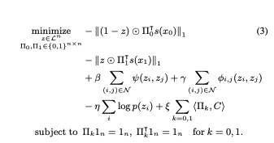
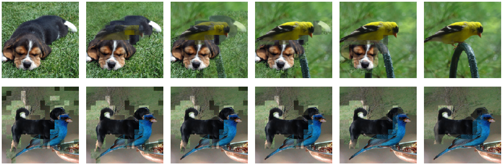
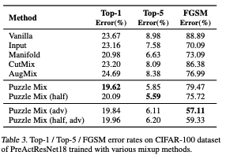
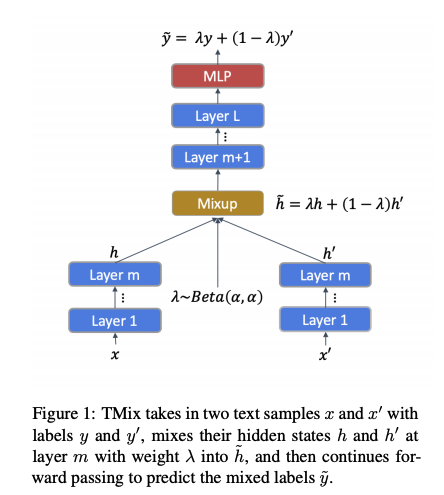

이번에 연구 주제와 관련되어서 [mixup](https://arxiv.org/pdf/1710.09412.pdf) 기반의 논문들을 읽어보고 공부하게 되었다.
여기서 중요하다고 느꼈던 점과 읽었던 부분들을 정리해보려고 한다.
시간이 지나면 다시 까먹을 것 같아서, 미리미리 정리해두는게 좋을것 같다.
(정리한 부분은 순전히 내가 읽고 받아들인 대로 적은 것이기 떄문에, 틀린 부분이 있을 수 있고,
잘못된 부분이 있다면 댓글로 알려주시면 정말 감사하겠습니다..ㅎㅎ)

먼저 [mixup](https://arxiv.org/pdf/1710.09412.pdf)이라는 논문에서 말하고자 하는 요지는 간단하다.

이 논문의 저자는 **mixup**이라는 term을 사용하는데, 결국

{x}_j), where x_i, x_j are raw input vectors,
{y}_j), where y_i, y_j are one-hot label encodings

이 수식이 논문의 모든 것을 설명해준다고 해도 과언이 아니다..(Markdown 으로 수식 표현하느라 힘들었다..)
즉, virtual example을 만드는데 있어서, x_i와 x_j를 일정한 비율(lambda)로 잘 섞어서, output label도 역시 섞어서 만들어준다는 것이다.

이렇게 하면 뭐가 좋은가?

이전의 training 기법들은 `ERM`(Empirical Risk Minimization)을 중심으로 learning을 시켰다. ERM이란, 경험적으로 주어진 set X와 Y에 대해서만 risk를 최소화한다는 것으로, 이렇게 하게 된다면 Adversraial attack에 취약하게 되고, generalizaiton하는 대신
empirical data에 대한 memorize를 하게 되는 방향으로 training된다고 볼 수 있다.
따라서 이렇게 되는 것을 막기 위해 training data augmentation을 하게 되는데, 
이것을 `VRM`(Vicinal Risk Minimization)이라고 한다. 

VRM이란, empirical data의 주변부(vicinity) 분포를 적절하게 모델링하고
이 data distribution에 대한 Risk를 minimization하는 것을 objective로 삼는 것이다. Semi-supervised learning의 한 종류로 봐도 좋을 것 같다.

또 여기서는 `manifold mixup`라는 표현도 사용했는데, 처음에는 manifold가 무슨 뜻인지 몰라서 찾아보았다.
manifold를 간단히 설명하자면, 두 개의 data가 eucledian distance상으로는 가까이 있지만, 사실상 비유클리디안 형태의 분포로 있기 때문에 가까운게 멀수도있고, 먼게 가까울수도 있다는 말이다.
즉, manifold mixup이란 두 Input x1과 x2의 함수를 취한 결과값 f(x1) 과 f(x2) 두개를 위의 식과 같이 섞어준다는 간단한 말로 표현될 수 있다.
([manifold 관련 참고한 설명글](https://mathematical-coffees.github.io/slides/mc01-courty.pdf))

여기까지가 ERM, VRM, 그리고 manifold mixup term에 대해 내가 이해한 바를 정리한 글이다.

그럼 이게 [PuzzleMix]랑 어떻게 관련이 되는지를 소개하도록 하겠다.
Puzzlemix는 기존에 있었던 mixup을 기반으로 한 data augmentation을 수행하는데, 크게 두 가지의 contribution을 주장한다.
첫 번째는, 기존에는 무작위로 섞었다면, 여기서는 sailency를 각 이미지에서 뽑아서 그 sailency를 보존하는 이미지를 만든다.
두 번째로는, 각 이미지에 존재하는 local statistics를 보존한다.

여기서 sailency란, "중요한 부분"을 나타내는 의미로서, 본문상에서는 vision분야에서는 foreground object, speech에서는 
prominant syallable, language에서는 informative textual unit등이 있다고 소개하고 있다.

PuzzleMix에서 formulate하는 수식은 위와 같다.

위에 있는 절댓값에 씌여져 있는 두 term이 input data x0 와 x1에 해당하는 masking 및 optimal transport를 적용한 결과값이고,
나머지 beta, gamma, eta, alpha가 noise data에 대한 smoothness를 결정한다.
아래 그림의 첫 줄은 각 두 이미지를 얼마나 섞을 것인가(lambda)가 달라짐에 따라 달라지는 결과 output이고,

두 번째 줄은 smoothness beta 와 mask r 를 얼마나 줄것인가 에 따라 달라지는 결과이다.

즉, 만들어진 virtual image상에서 각 픽셀에 기존의 이미지를 얼마 비율로 섞을 것인가를 의미한다. 이것이 r의 값이다.
해당 픽셀에 r이 1/2이라면 output image는 두 Input image의 픽셀값이 골고루 둘다 들어가는 것이고, r이 0이거나 1이면
두 이미지 중 하나의 값만 들어가게 되는 것이다. 이렇게 골고루 적절히 잘 섞이게 하여 hyperparameter를 조정하여 이미지를
만들어낼 수 있다. 수식에서 pi에 해당하는 것은 각 이미지를 어떻게 optimal 하게 transport시킬 수 있는가에 대한 것이다.

그 뒤에서 논문이 설명하는 것은 어떻게 하면 optimal transport를 빠르게 할 수 있는지(mini batch단위로 computation을 돌리는데 o(n^3)의
time complexity를 갖고 있기 때문에 그대로 적용하기 보다는 여러 가지 증명과정을 거쳐서 approximation이 가능하다는 것을 보이고
빠르게 계산하게 된다)를 증명하고 방법을 알려주고 있다.

그 뒤는 이렇게 하는 것이 adversarial example을 만드는 것과 비슷한 효과를 낸다, 또는 adversarial example을 어떠한
추가적인 computational cost 없이 만드는 것이 가능하다는 이야기를 한다. (이 부분은 정확히 이해하지 못했다. 추후 더 읽고 이해한 후
수정할 예정이다.)

논문의 마지막은 Vanilla, Input, Manifold, CutMix, AugMix 등 다양한 mixup 기반의 메소드들 보다 PuzzleMix이 월등히 높은 성능 낸다는 것을 보여주고 있다.
puzzleMix(half)란, 기존의 training방법보다 총 iteration하는 epoch수를 반으로 줄이고 initial learning rate를 2배 해서 training을 돌린 것을 이야기한다.
computational cost 대비 fair comparison을 위해 추가하였다고 말하고 있다.
또, top-1 외에 top-2 dataset에 대해 다른 것들보다 훨씬 더 좋은 성능을 보인다는 것을 보이고 있다. 이것을 generalization을 잘한다고 말할 수 있을 것 같다.(나만의 결론이다. 틀릴 수도 있다..)

여기서는 1.tiny-imagenet, 2.imagenet, 3.cifar-100 등 유명한 classification 위주의 dataset에 대해서 train해보았다고 말하고 있다.

이걸 text에 바로 적용하기에는 문제가 있는데, 먼저 text는 image처럼 연속적인 픽셀값으로 이루어져 있는 것이 아니기 때문이다.
그렇다면 어떻게 해야 할까? mixup 기반의 method를 nlp에도 apply한 논문이 있는데, [mixtext](https://arxiv.org/pdf/2004.12239.pdf) 가 바로 그것이다.
이번 ACL 2020에 accept된 따끈따끈한 paper이다. 여기서 주요 contribution으로 주장하는 것은, mixup idea를 문장에 바로 적용할수가 없으니까,
hidden layer에 적용해보자! 이다. 이것은 어떻게 보면 manifold mixup의 한 형태로 볼 수 있을 것 같다.
이 아이디어는 논문 안에 있는 도식도를 보면 바로 이해가 잘 된다. 저자들은 이것을 mixtext로 칭하고 있다.

