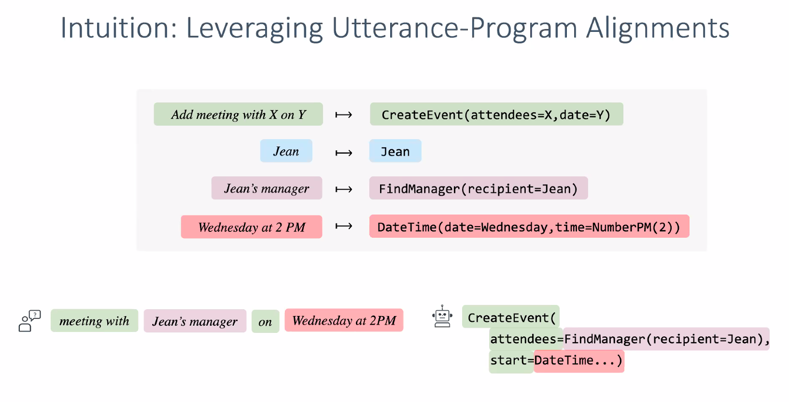
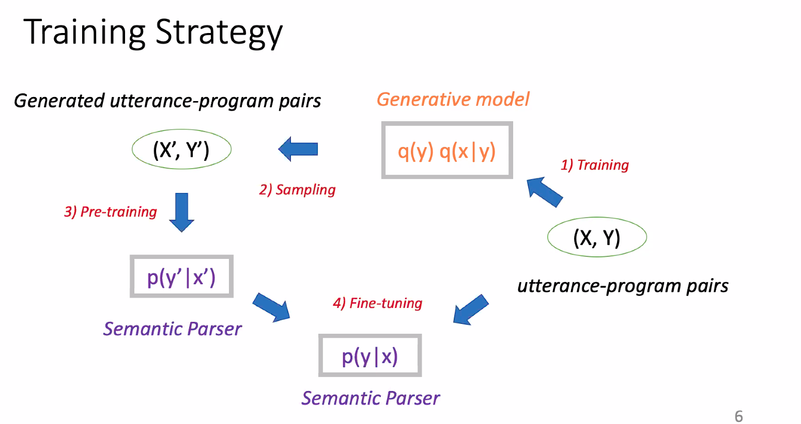

Here are the brief notes that I took from listening to the oral presentations of great authors (mainly focused on text-to-SQL)

### [Latent Compositional Representations improve systematic generalization in grounded answering](https://arxiv.org/pdf/2007.00266.pdf)

They make trees on all latent 

Tree helps whether the model is really correct or not.

Beam search can help 

### [Learning from executions for semantic parsing](https://www.aclweb.org/anthology/2021.naacl-main.219.pdf)

Executable program <- model that only uses labeled data

Lower bound that uses the labeled examples

Grammar-based <- forcing at training time, more correct that you do that in test time.

Assume that topk is not always executable

Pretrained parser already has some knowledge about what is right and what is wrong -> have to somehow renormalize the topk items

Trying to utilize the unlabeled data. How are we going to do learning from that?

not all the programs are not executable. Assign non-executable programs have very small loss.

Executability is a free signal. It is weak because we don't know the answer.

We maximize marginal likelihood for all possible executable programs -> but all is infeasible. We utilize the beam searched query.  But it seems kind of unfair. Encourage model to explore more executable models during program(motivation)

provide sparsity on the executable programs <- They can be executable but not correct(second motiviation)

y is our program, 0 otherwise. We want p (distribution of our parser) to be as similar as Q. Executable programs are always in this family. There is only 6 executable programs. It is discrete but the domain for executable program is continuous(?)

Distance metric is KL divergence. As long as p is close to Qx, we are happy. It could be anywhere to q. x

Grammar-based decoding <- Limit search space to executable programs.

We already do that. Grammatical != Executable difference? <- column type constraints? 

### [Compositional generalization for neural semantic parsing via span-level supervised attention](https://www.aclweb.org/anthology/2021.naacl-main.225.pdf)

-> span-level supervised attention

encourage models with span-level alignments? Semantic parser is seq-to-seq example.

contains syntac-level MT limitations

uses the outputs from this syntactic level alignments -> find bounding box

### [Incorporating external knowledge to enhance tabular reasoning](https://www.aclweb.org/anthology/2021.naacl-main.224.pdf)

how do you represent tabular data to text? Can we incoporate external knowledge to model?

1. poor representation of tabular information
2. Implicit lexical knowledge
3. presensce of distracting 
4. missing domain knowledge about keys

We use entity types for better table representation. Prune table according to it.

Preprocessing helps on alpha1 and alpha3.

### [Learning to synthesize data for semantic parsing](https://www.aclweb.org/anthology/2021.naacl-main.220.pdf)

similar to back translation 

Hand-crafting rules are not very good objective -> you don't know what the dataset will look like.

Utterance doesn't make sense, but maybe the model can learn from the correspondance.

